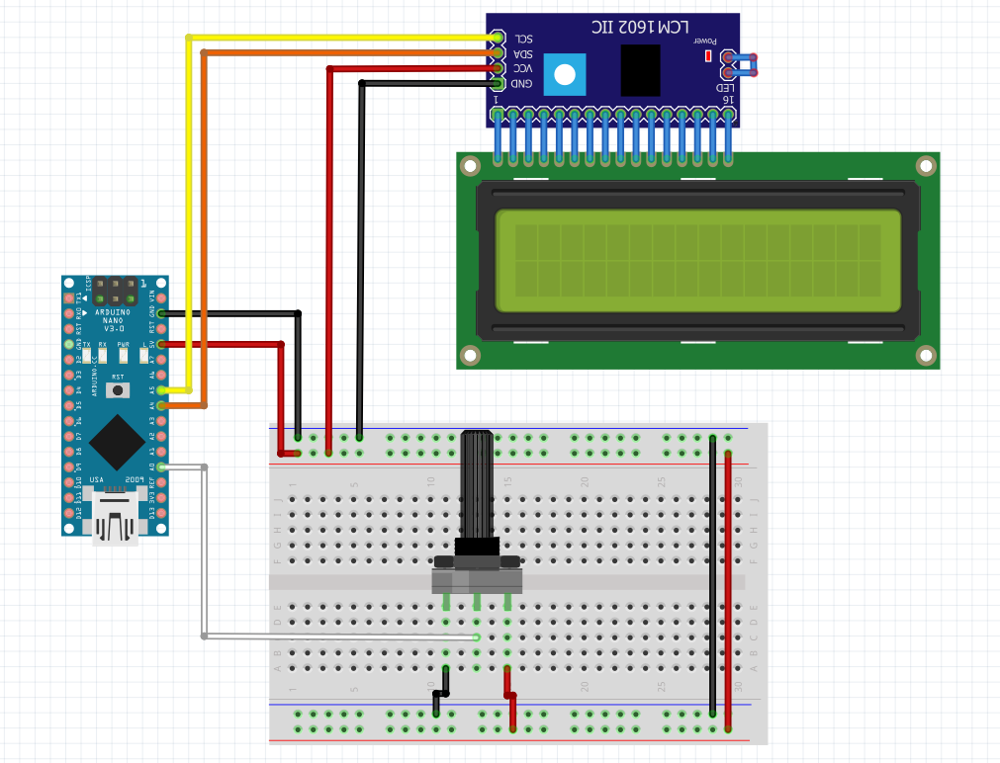

# arduino-lcd-slicer
Arduino sketch that demonstrates controlling an I2C 20x4 LCD with a potentiometer. The potentiometer reading determines how many characters of a predefined message are shown on the first row of the LCD (capped at 20 characters). Debug information including the raw analog reading and the exact displayed text is printed to the Serial Monitor.

## Hardware Requirements

- Arduino board (e.g., Nano, Uno, Mega – any board with I²C support)  
- LCD1602 display with I²C interface  
- Potentiometer (10 kΩ recommended)  
- Jumper wires and breadboard (optional, for prototyping)  

## Wiring Instructions

### Potentiometer
- Center pin → `A0` (analog input)  
- Side pins → `5V` and `GND`  

### LCD (I²C interface)
- `SDA` → connect to your board’s **SDA pin**  
- `SCL` → connect to your board’s **SCL pin**  
- `VCC` → `5V`  
- `GND` → `GND`  

### Notes
- **Arduino Nano / Uno** → `SDA = A4`, `SCL = A5`  
- **Arduino Mega** → `SDA = pin 20`, `SCL = pin 21`   

If you’re using a different Arduino board, check the official documentation for the correct SDA/SCL pin locations.

## Schematic

Editable source: [schematic.fzz](docs/lcd_pot_schematic.fzz)
